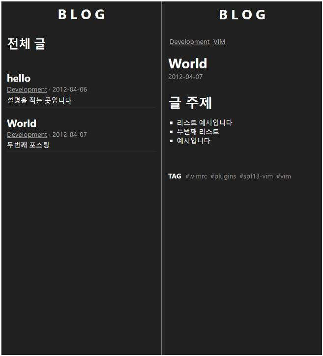
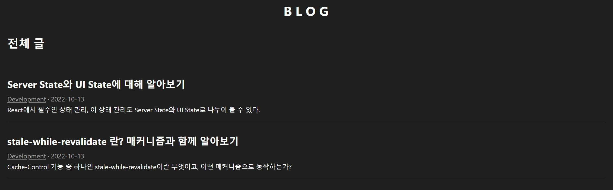

# 원티드 프리온보딩 챌린지 10월 2일차 과제

## 결과물

### markdown으로 작성한 정적 페이지 만들기



### swr 라이브러리를 적용한 후, vercel로 배포하기



### 배포한 페이지 링크

https://next-app-gaeundev.vercel.app/

### 블로그 포스팅

- [과제를 진행하는 과정이 담긴 글 링크 (클릭)](https://tistory.rooteun.com/98)
- [Vercel로 앱 배포하기 포스팅(클릭)](https://tistory.rooteun.com/99)

## 실행

```shell
$ npm ci
$ npm run build
$ npm run start
```

참고로 markdown 파싱은 heading 과 list의 1depth만 만들어 놓은 상태입니다.

## 과제내용

- Next.js로 마크다운으로 작성한 블로그를 정적 페이지(SSG)로 작성하기

### 폴더 구조 및 라우팅

- 사용자는 루트 경로의 \_\_posts 폴더에 작성된 마크다운 파일(.md)를 작성할 수 있어야 한다.
- 해당 파일은 마크다운 본문과 게시물에 대한 meta data를 담을 수 있어야 한다.
- 아래는 마크다운에 jekyll에서 만든 frontmatter라는 문법(링크)을 적용한 예시

```markdown
---
categories:
  - Development
  - VIM
date: '2012-04-06'
description: 설명을 적는 곳입니다
slug: spf13-vim-3-0-release-and-new-website
tags:
  - .vimrc
  - plugins
  - spf13-vim
  - vim
title: hello
---

## 예시입니다

- 예시입니다
```

- 블로그에 작성된 게시물을 렌더링하는 `목록 페이지`와 개별 게시물을 렌더링하는 `상세 페이지`로 나누어 작성
  - `/` - 목록 페이지
  - `/[id]` - 상세 페이지
  - 마크다운을 JavaScript로 변환해주는 도구는 `remark`(마크다운 Parser), `remark-html`(remark로 파싱한 데이터를 html로 변환) 을 참고
  - 각 마크다운의 meta data는 `gray-matter`, `frontmatter` 참고
  - 마크다운을 React에 삽입할 때는 `dangerouslySetInnerHTML` 을 사용 ([참고 링크](https://ko.reactjs.org/docs/dom-elements.html#dangerouslysetinnerhtml))
  - (추가 구현) 코드 하이라이터는 `highlight.js`, `prism.js` 를 참고

### Prefetching 메서드를 적절히 사용할 것

- 정적 페이지를 생성할 때 필요한 데이터 생성 → `getStaticProps`
- 각 포스트를 그려줄 상세 페이지 경로를 생성 → `getStaticPaths`

### 참고 자료

- NextJs Static

  - https://nextjs.org/docs/basic-features/data-fetching/get-static-paths
  - https://nextjs.org/docs/basic-features/data-fetching/get-static-props

- markdown meta data

  - https://jekyllrb.com/docs/front-matter/
  - https://frontmatter.codes/docs/content-creation#overview

- markdown parsing
  - https://github.com/remarkjs/remark/tree/main
  - https://github.com/syntax-tree/mdast-util-from-markdown
